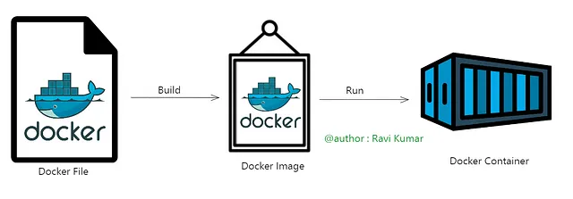
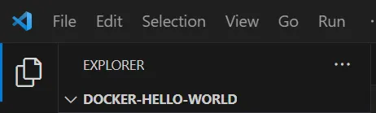
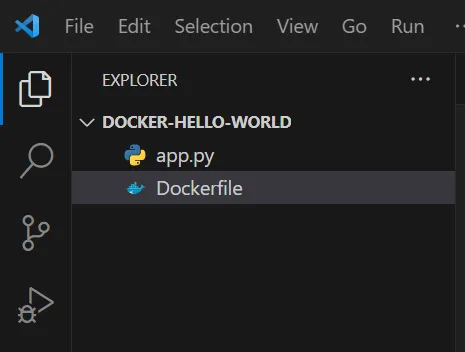
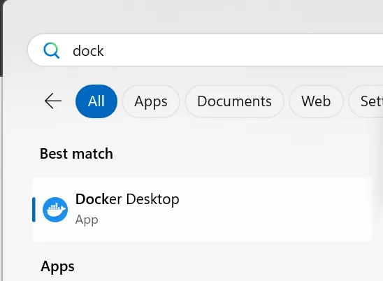
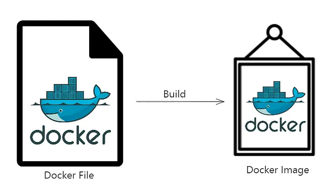
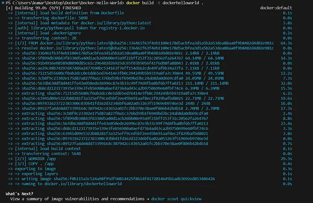
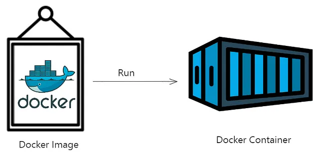
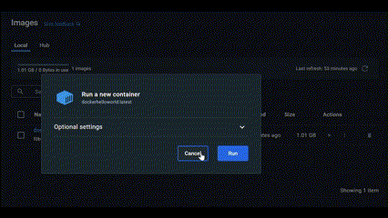
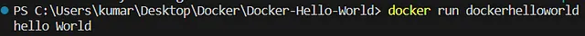

# Docker🐋: Hello World👋🧑‍💻

Topics covered:

- What is Docker?
- Difference between containerization and virtualization
- What is Dockerfile, Image, and Container?
- Step by Step Process to create the Docker project
- Conclusion

## What is Docker?


In simple words, docker is a platform for developing, shipping, and running applications using containers.

**Benefits of Docker:**

- **Fast Delivery**: Docker streamlines the development lifecycle, reducing the delay between writing code and running it in production.
- **Portability**: Containers can run on laptops, data centers, cloud providers, or a mix of environments. They’re highly portable and lightweight.
- **Scalability**: Docker allows dynamic management of workloads, scaling applications up or down as needed.
- **Efficiency**: Containers use server capacity more effectively than traditional virtual machines.

## Difference between containerization and virtualization

```
| Aspect         | Containerization                                  | Virtualization                                |
|----------------|---------------------------------------------------|-----------------------------------------------|
| Isolation      | Uses OS-level isolation, sharing the host kernel  | Provides full isolation, each VM has its OS   |
| Resource Usage | Lightweight, shares host resources efficiently    | Relatively heavier, requires more resources   |
| Performance    | Generally higher performance due to less overhead | Slightly lower performance due to abstraction |
| Startup Time   | Faster startup times                              | Slower startup times                          |
| Dependency     | Application-centric dependencies                  | OS-centric dependencies                       |
| Portability    | Highly portable across environments               | Portable but may require more configuration   |
| Maintenance    | Easier to maintain due to fewer components        | More complex maintenance due to multiple OSes |
| Scalability    | Easier to scale horizontally                      | Can be more resource-intensive to scale       |
```

## What is Dockerfile, Image, and Container?



- **Dockerfile**: A text file containing instructions to build a Docker image.
- **Docker Image**: A lightweight, standalone, executable package that includes everything needed to run a piece of software, including the code, runtime, libraries, and dependencies.
- **Docker Container**: An instance of a Docker image that runs a software application and encapsulates its dependencies.

## Step by Step Process to create the Docker project

1. Create a Directory “Docker-Hello-World”
2. Open the Folder/ Choose the folder in VS code or any IDE you are using.



3. We have to create 2 files:
   


- `app.py`: This is going to be our Python file with only one line of code.
```
print("hello World")
```
- **Dockerfile** (This name is case sensitive and without any extension): This file will have all the step-by-step process of how we are going to ship this project and what all the commands will be executed.

```
FROM python
WORKDIR /app
COPY . /app
CMD ["python", "app.py"]


# FROM python -sets the base image as an official Python image.

# WORKDIR /app -changes the working directory to /app inside the container.

# COPY . /app -copies the contents of the current directory into the /app directory within the container.

# CMD [“python”, “app.py”] -specifies that the app.py script should be executed using the Python interpreter when a container is started.

```
4. Keep your Docker Desktop app up and running



5. Now follow the commands to build the image



- Build the Docker image: Open the VS code terminal and follow along
  
```
docker build -t dockerhelloworld .
```

- `docker build`: Command used to build Docker images from a Dockerfile.
- `-t dockerhelloworld`: Tag option used to assign a name and optionally a tag to the Docker image being built (in this case, "dockerhelloworld").
- `.`: Here .represents the current directory.



6. To run the image you can use two ways.



- **First**: Go to the Docker desktop and run the container (See the GIF below)



- **Second**: Using VS Code Terminal:

```
docker run dockerhelloworld
```



## Conclusion

In this post, we covered multiple topics in Docker like containerization and virtualization, and a step-by-step guide on how to run your first “Hello World” Python program in a Docker container.

## More about me:

I am a Data Science enthusiast🌺, Learning and exploring how Math, Business, and Technology can help us to make better decisions in the field of data science.

Want to read more: https://medium.com/@ravikumar10593/

YouTube Link (100k+ views): https://www.youtube.com/raviscontent

Find my all handles: https://linktr.ee/ravikumar10593